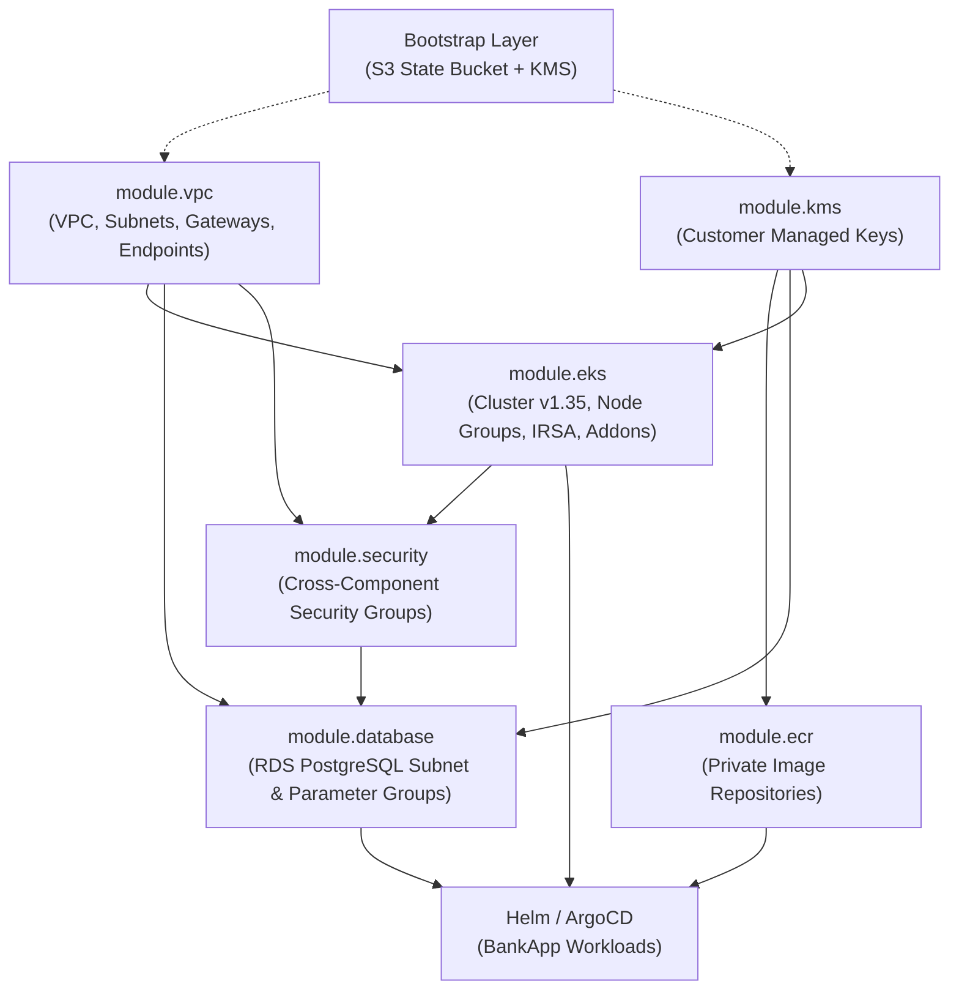

# Enterprise Cloud Platform on AWS EKS

> An end-to-end, production-grade cloud-native banking platform provisioned on **Amazon EKS** using **Terraform (IaC)**, **Kubernetes**, **Amazon RDS (PostgreSQL)**, **AWS KMS**, **Amazon ECR**, **External Secrets Operator**, **Helm**, and **GitHub Actions CI/CD with GitOps**.

---


-000000?logo=next.js&logoColor=white)


---

## Table of Contents
1. [Project Overview](#project-overview)
2. [Current Project Status](#current-project-status)
3. [Architecture & Infrastructure Design](#architecture--infrastructure-design)
4. [Technology Stack & Tools Matrix](#technology-stack--tools-matrix)
5. [The Application: BankApp](#the-application-bankapp)
6. [Kubernetes & Helm Architecture](#kubernetes--helm-architecture)
7. [Security & Compliance Highlights](#security--compliance-highlights)
8. [CI/CD & GitOps Workflow](#cicd--gitops-workflow)
9. [Repository Structure](#repository-structure)
10. [Operational Runbook & Deployment Guide](#operational-runbook--deployment-guide)

---

## Project Overview

**Project EKS-Platform** is a production-oriented cloud platform that demonstrates how to architect, secure, deploy, and operate a multi-tier microservices workload on AWS at an enterprise level.

The platform provisions a dedicated, highly available, multi-AZ Virtual Private Cloud (VPC) that hosts an **Amazon EKS cluster (v1.35)**, an **Amazon RDS PostgreSQL database**, **AWS KMS customer-managed keys**, and **Amazon ECR container registries**. Deployed on this platform is **BankApp**—a secure digital banking application consisting of a Next.js 16 frontend and an Express/Node.js 22 TypeScript backend connected via zero-trust Kubernetes network policies and integrated with AWS Secrets Manager via the External Secrets Operator.

---

## Current Project Status

| Component | Status | Details |
| :--- | :--- | :--- |
| **Terraform Infrastructure Modules** | `Production-Ready` | Fully modularized (`networking`, `security`, `kms`, `ecr`, `database`, `eks`). |
| **Bootstrap Automation** | `Operational` | Python utility (`bootstrap.py`) manages remote state S3 bucket & KMS keys with zero manual click-ops. |
| **BankApp Microservices** | `Complete` | Full Next.js 16 frontend, Express backend, Prisma ORM schema, and automated migrations. |
| **Containerization** | `Hardened` | Multi-stage Dockerfiles configured to run as non-root `USER node`. |
| **Helm Packaging** | `Version 0.1.0` | Comprehensive chart with Deployments, Services, ALB Ingress, PDB, HPA, NetworkPolicies, and ESO. |
| **CI/CD Pipeline** | `Automated` | GitHub Actions workflow (`ci.yaml`) with OIDC AWS authentication, matrix builds, ECR push, and GitOps tag updates. |
| **Environment Lifecycle** | `Cost-Optimized` | The `dev` infrastructure underwent full validation and end-to-end traffic testing. Live cloud resources are deprovisioned on-demand when idle to minimize AWS costs, while remaining 100% reproducible via Terraform in ~15 minutes. |

---

## Architecture & Infrastructure Design

### High-Level Architecture Diagram

```
+---------------------------------------------------------------------------------------------------+
|                                       AWS Cloud (ap-south-1)                                      |
|                                                                                                   |
|  +---------------------------------------------------------------------------------------------+  |
|  |                                  VPC: 10.0.0.0/16                                           |  |
|  |                                                                                             |  |
|  |   +------------------------------------+       +------------------------------------+       |  |
|  |   |        Availability Zone A         |       |        Availability Zone B         |       |  |
|  |   |                                    |       |                                    |       |  |
|  |   |  [Public Subnet 10.0.1.0/24]       |       |  [Public Subnet 10.0.2.0/24]       |       |  |
|  |   |  - Internet Gateway (IGW)          |       |  - NAT Gateway (Elastic IP)        |       |  |
|  |   |  - AWS Application Load Balancer   |       |  - ALB Failover Path               |       |  |
|  |   +------------------------------------+       +------------------------------------+       |  |
|  |                     |                                            |                          |  |
|  |                     v                                            v                          |  |
|  |   +------------------------------------+       +------------------------------------+       |  |
|  |   |    Application Subnet 10.0.11.0/24 |       |    Application Subnet 10.0.12.0/24 |       |  |
|  |   |  - EKS Managed Node Group          |       |  - EKS Managed Node Group          |       |  |
|  |   |    - Frontend Pods (Next.js)       |       |    - Frontend Pods (Next.js)       |       |  |
|  |   |    - Backend Pods (Express)        |       |    - Backend Pods (Express)        |       |  |
|  |   |    - AWS Load Balancer Controller  |       |    - External Secrets Operator     |       |  |
|  |   |    - ArgoCD GitOps Engine          |       |    - CoreDNS / VPC CNI             |       |  |
|  |   |  - VPC Interface Endpoints         |       |  - S3 Gateway Endpoint             |       |  |
|  |   +------------------------------------+       +------------------------------------+       |  |
|  |                     |                                            |                          |  |
|  |                     v                                            v                          |  |
|  |   +------------------------------------+       +------------------------------------+       |  |
|  |   |      Database Subnet 10.0.21.0/24  |       |      Database Subnet 10.0.22.0/24  |       |  |
|  |   |  - Amazon RDS PostgreSQL (Primary) |       |  - Amazon RDS Standby (Multi-AZ)   |       |  |
|  |   |  - Port 5432 (Isolated from Web)   |       |  - Encrypted with RDS KMS Key      |       |  |
|  |   +------------------------------------+       +------------------------------------+       |  |
|  |                                                                                             |  |
|  +---------------------------------------------------------------------------------------------+  |
|                                                                                                   |
|   +--------------------------+  +--------------------------+  +--------------------------------+  |
|   | AWS ECR Repositories     |  | AWS KMS CMKs             |  | S3 State & Secrets Manager     |  |
|   | - Immutable Image Tags   |  | - Keys: ECR, EKS, RDS    |  | - S3 State with SSE-KMS        |  |
|   | - Continuous Scanning    |  | - Automatic Rotation     |  | - Secrets Manager Credential   |  |
|   +--------------------------+  +--------------------------+  +--------------------------------+  |
+---------------------------------------------------------------------------------------------------+
```

### Module Dependency Graph



---

## Technology Stack & Tools Matrix

### 1. Cloud & Infrastructure (AWS)
| Tool / Service | Purpose | Configuration Details |
| :--- | :--- | :--- |
| **Amazon EKS** | Managed Kubernetes Control Plane | Kubernetes v1.35, OIDC provider enabled for IAM Roles for Service Accounts (IRSA). |
| **EKS Managed Node Groups** | Compute Capacity | Auto-scaling EC2 instances across multiple AZs (`c7i-flex.large`), non-root container support. |
| **Amazon VPC** | Network Isolation | CIDR `10.0.0.0/16`, 6 subnets across 2 AZs (Public, App, Database), NAT Gateway, Internet Gateway. |
| **Amazon RDS** | Relational Database | PostgreSQL 16+, Multi-AZ subnet groups, dedicated parameter group, KMS encryption at rest. |
| **Amazon ECR** | Container Image Registry | Immutable image tags, automated continuous vulnerability scanning on push. |
| **AWS KMS** | Cryptographic Key Management | Customer Managed Keys (CMKs) for ECR, RDS, EKS envelope encryption, and S3 state storage. |
| **AWS Secrets Manager** | Secure Credential Storage | Stores RDS database credentials; dynamically fetched into Kubernetes via External Secrets. |
| **AWS Application Load Balancer** | Layer 7 Ingress Traffic | Managed dynamically via AWS Load Balancer Controller with target-type IP routing. |

### 2. Infrastructure as Code & Automation
| Tool | Version | Role in Platform |
| :--- | :--- | :--- |
| **Terraform** | `1.5+` | Multi-tier IaC provisioning using reusable modules (`networking`, `security`, `kms`, `ecr`, `database`, `eks`). |
| **Python / Boto3** | `3.10+` | Custom automation CLI (`bootstrap.py`) verifying AWS credentials, S3 backend buckets, and Terraform lifecycles. |
| **AWS CLI v2** | Latest | Programmatic management, cluster kubeconfig updates, and AWS operational control. |

### 3. Application & Microservices Stack (BankApp)
| Tier | Technology | Key Highlights |
| :--- | :--- | :--- |
| **Frontend** | **Next.js 16 (React 19)** | App Router, Lucide Icons, TypeScript, CSS Modules, JWT authentication context, responsive UI. |
| **Backend** | **Node.js 22 + Express** | TypeScript, RESTful endpoints (`/api/auth`, `/api/accounts`, `/api/transfers`, `/api/loans`), `/health` probes. |
| **Data Layer** | **Prisma ORM** | PostgreSQL schema with `User`, `Account`, `Transaction`, `Beneficiary`, and `Loan` relational models. |
| **Security** | **bcrypt + jsonwebtoken** | Salted password hashing (10 rounds) and stateless JWT token-based authorization. |

### 4. Kubernetes Platform & GitOps Tooling
| Component | Function | Implementation |
| :--- | :--- | :--- |
| **Helm 3** | Package Manager | Unified chart `helm/bankapp` packaging microservices, configs, and policies. |
| **AWS Load Balancer Controller** | Ingress Controller | Provisions and reconciles AWS ALBs for external HTTP/HTTPS traffic directly to pod IPs. |
| **External Secrets Operator** | Secret Synchronization | Synchronizes credentials from AWS Secrets Manager into native Kubernetes `Secret` resources. |
| **ArgoCD** | GitOps Deployment Engine | Declarative Git-driven reconciliation between the Git repository and the Kubernetes cluster state. |
| **Core EKS Add-ons** | Cluster Networking | AWS VPC CNI, CoreDNS, Kube-Proxy, and Metrics Server. |

### 5. CI/CD & DevOps
| Tool | Function | Workflow |
| :--- | :--- | :--- |
| **GitHub Actions** | Automated CI/CD | Linting, testing, Docker image building, ECR publishing, and GitOps value patching. |
| **AWS OIDC Integration** | Keyless Authentication | Uses GitHub OIDC identity tokens to assume AWS IAM roles without static credentials. |
| **yq** | YAML Manipulation | Automatically updates Docker image SHAs in `helm/bankapp/values.yaml` upon commit. |

---

## The Application: BankApp

The platform hosts **BankApp**, a modern banking application engineered for high-availability cloud deployments:

- **Authentication**: JWT-based authentication with secure cookie/header handling.
- **Account Management**: Real-time checking and savings account balances with unique account numbers.
- **Funds Transfer**: Atomic fund transfers between user accounts and registered external beneficiaries.
- **Loan Management**: Multi-status loan application system (`PENDING`, `APPROVED`, `REJECTED`) with automated interest rate calculations.
- **Transaction History**: Real-time categorized transaction ledger (`GROCERIES`, `SALARY`, `TRANSFER`, `ENTERTAINMENT`).
- **Database Health**: Dedicated `/health` endpoint validating live PostgreSQL connectivity via Prisma query execution.

---

## Kubernetes & Helm Architecture

The application is deployed to Amazon EKS using a production-tuned Helm chart ([`helm/bankapp`](file:///run/media/haris/New%20Volume/florence/helm/bankapp)):

```
helm/bankapp/
├── Chart.yaml                  # Chart metadata (v0.1.0)
├── values.yaml                 # Configurable parameters (replicas, ports, images, ingress)
└── templates/
    ├── frontend-deployment.yaml     # 2-replica Next.js deployment with non-root security context
    ├── frontend-service.yaml        # Internal ClusterIP service (port 80 -> 3000)
    ├── backend-deployment.yaml      # 2-replica Express backend with DB connection pool
    ├── backend-service.yaml         # Internal ClusterIP service (port 8080)
    ├── ingress.yaml                 # AWS ALB Ingress with path-based routing (/ and /api)
    ├── external-secrets.yaml        # ExternalSecret pulling DB credentials from AWS Secrets Manager
    ├── store.yaml                   # ClusterSecretStore mapping to AWS Secrets Manager
    ├── network-policy.yaml          # Zero-Trust isolation rules between namespaces and pods
    ├── pdb.yaml                     # PodDisruptionBudgets (minAvailable: 1)
    └── hpa.yaml                     # HorizontalPodAutoscalers for dynamic CPU/memory scaling
```

### High Availability Features
- **Pod Disruption Budgets (PDB)**: Guarantees at least 1 pod replica remains active during cluster updates or node drains.
- **Pod Topology Spread Constraints / Affinity**: Ensures pod replicas are scheduled across distinct Availability Zones.
- **Horizontal Pod Autoscaling (HPA)**: Automatically scales backend and frontend replicas under load.
- **Zero-Trust Network Policies**: Restricts egress/ingress traffic so only authorized frontend pods can communicate with backend endpoints, and only backend pods can access PostgreSQL port 5432.

---

## Security & Compliance Highlights

1. **Envelope Encryption with AWS KMS**:
   - Dedicated KMS keys with automatic annual rotation for RDS databases, ECR container registries, and EKS secret encryption.
2. **Keyless CI/CD Authentication (OIDC)**:
   - No long-lived AWS IAM access keys stored in GitHub Secrets. Workflows utilize GitHub OpenID Connect (OIDC) to assume short-lived IAM roles.
3. **IAM Roles for Service Accounts (IRSA)**:
   - Pods assume least-privilege IAM roles via Kubernetes ServiceAccounts (e.g., AWS Load Balancer Controller and External Secrets Operator).
4. **Network Micro-Segmentation**:
   - Public subnets for load balancers only; application pods reside in private subnets; RDS instances are completely isolated in private database subnets with no internet ingress.
5. **Container Security**:
   - Multi-stage Docker builds dropping privileges to `USER node` (UID 1000) to prevent container escape exploits.

---

## CI/CD & GitOps Workflow

```
Developer Push to 'main'
         │
         ▼
[GitHub Actions: test-and-build]
  ├── Setup Node.js 22
  ├── npm ci (Frontend & Backend)
  ├── ESLint check
  └── TypeScript production build (tsc)
         │
         ▼ (on success)
[GitHub Actions: publish]
  ├── Assume IAM Role via OIDC (Keyless AWS Auth)
  ├── Authenticate with Amazon ECR
  ├── Build & tag Docker images ($GITHUB_SHA)
  ├── Push images to Amazon ECR repositories
  └── Update image tags in helm/bankapp/values.yaml via yq
         │
         ▼
[Git Commit & Push back to main]
         │
         ▼
[ArgoCD / GitOps Sync]
  └── Reconciles new image tags and deploys rolling update to EKS
```

---

## Repository Structure

```
.
├── .github/
│   └── workflows/
│       └── ci.yaml             # Complete CI/CD GitHub Actions pipeline
├── architecture/
│   └── ADR_RDS.md              # Architecture Decision Record for Amazon RDS module
├── bank-app/                   # Full-Stack Banking Application
│   ├── frontend/               # Next.js 16 App Router UI
│   │   ├── app/                # Pages: /login, /register, /dashboard, /transfer, /loans
│   │   ├── Dockerfile          # Hardened non-root Next.js container image
│   │   └── package.json
│   └── backend/                # Node.js + Express TypeScript API
│       ├── prisma/             # Relational PostgreSQL schema & migrations
│       ├── index.ts            # REST controllers, health checks, JWT auth
│       ├── Dockerfile          # Hardened non-root Node.js container image
│       └── package.json
├── helm/
│   └── bankapp/                # Production Helm chart (Deployments, Ingress, PDB, HPA)
├── terraform/                  # Modular Infrastructure as Code
│   ├── README.md               # In-depth Terraform architecture & reference manual
│   ├── bootstrap/              # S3 Remote State Bucket + KMS Key
│   ├── modules/
│   │   ├── networking/         # Custom VPC, Multi-AZ subnets, NAT GW, IGW, Endpoints
│   │   ├── security/           # Cross-component Security Group rules
│   │   ├── kms/                # Customer Managed Keys with automatic key rotation
│   │   ├── ecr/                # Container repositories with vulnerability scanning
│   │   ├── database/           # Amazon RDS PostgreSQL instance & parameter groups
│   │   └── eks/                # EKS Cluster (v1.35), Managed Node Groups, OIDC IRSA
│   └── environemnts/
│       └── dev/                # Root Dev composition environment
└── bootstrap.py                # Python automation script for state & bootstrap lifecycle
```

---

## Operational Runbook & Deployment Guide

### Prerequisites
- **AWS CLI v2** configured with administrative permissions in `ap-south-1`.
- **Terraform** (`>= 1.5.0`).
- **Kubectl** (`>= 1.30.0`).
- **Helm 3** (`>= 3.12.0`).
- **Python 3.10+** and `boto3`.

### Step 1: Initialize Bootstrap Storage (Remote State)
Run the automated bootstrap script to provision the encrypted S3 backend bucket and KMS alias:
```bash
python3 bootstrap.py
# Select Option 1: Bootstrap
```
*Or manually:*
```bash
cd terraform/bootstrap
terraform init
terraform apply -auto-approve
```

### Step 2: Deploy Infrastructure (Dev Environment)
Deploy the VPC, security groups, KMS keys, ECR repositories, RDS database, and EKS cluster:
```bash
cd terraform/environemnts/dev
terraform init
terraform apply -auto-approve
```

### Step 3: Update Kubeconfig & Verify Cluster
Configure local `kubectl` context to communicate with the newly provisioned EKS cluster:
```bash
aws eks update-kubeconfig --region ap-south-1 --name eks-platform-dev-cluster
kubectl get nodes -o wide
```

### Step 4: Deploy BankApp via Helm
Deploy the microservices workloads into the cluster:
```bash
helm upgrade --install bankapp ./helm/bankapp \
  --namespace bankapp \
  --create-namespace
```

Verify deployment health:
```bash
kubectl get pods,svc,ingress -n bankapp
```

### Step 5: Clean Up & Deprovision (Cost Savings)
To tear down the infrastructure when not in active use:
```bash
# 1. Destroy application & dev infrastructure
cd terraform/environemnts/dev
terraform destroy -auto-approve

# 2. Destroy bootstrap remote state bucket & KMS key
cd ../../bootstrap
python3 -c '
import boto3
s3 = boto3.resource("s3", region_name="ap-south-1")
s3.Bucket("eks-platform-dev-020139096715-ap-south-1").object_versions.delete()
'
terraform destroy -auto-approve
```

---

## Contributing & Maintenance

- **Lead Maintainer**: Haris ([@muhdhares](https://github.com/muhdhares))
- **Repository**: [https://github.com/muhdhares/eks-platform](https://github.com/muhdhares/eks-platform)
- **License**: ISC
