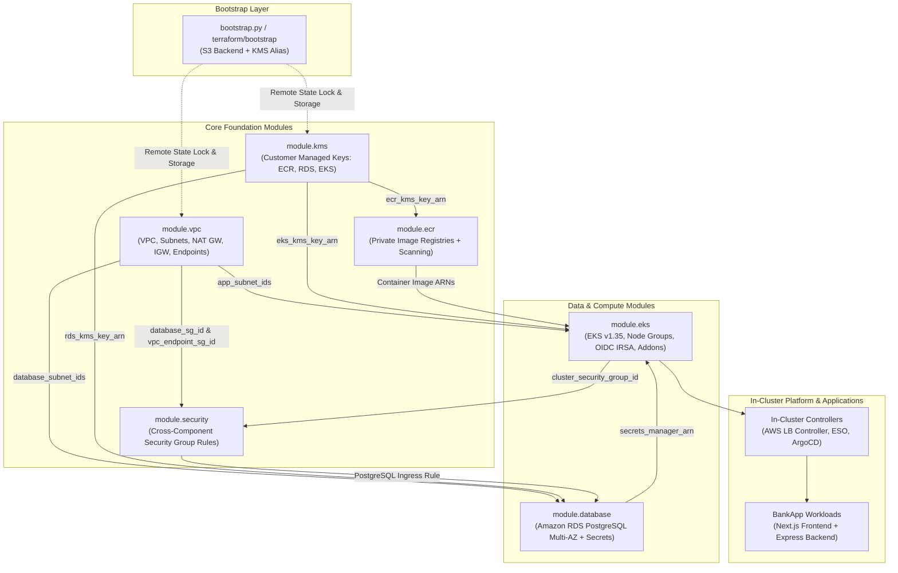

# Enterprise Cloud Platform on Amazon EKS (BankApp)

> A production-grade, highly available, and secure cloud-native banking platform provisioned on **Amazon EKS (v1.35)** using **Terraform (IaC)**, **AWS KMS**, **Amazon RDS (PostgreSQL)**, **Amazon ECR**, **External Secrets Operator**, **AWS Load Balancer Controller**, **Helm 3**, and **GitHub Actions CI/CD with GitOps (ArgoCD)**.

---


-000000?logo=next.js&logoColor=white)


---

## Table of Contents

1. [Executive Summary & Project Overview](#1-executive-summary--project-overview)
2. [Current Project Status](#2-current-project-status)
3. [Architecture & Infrastructure Design](#3-architecture--infrastructure-design)
   - [3.1 High-Level Architecture Diagram](#31-high-level-architecture-diagram)
   - [3.2 Modular Terraform Topology & Data Flow](#32-modular-terraform-topology--data-flow)
   - [3.3 Zero-Trust Network Traffic Flow](#33-zero-trust-network-traffic-flow)
4. [Complete Technology Stack & Tools Matrix](#4-complete-technology-stack--tools-matrix)
5. [The Application: BankApp](#5-the-application-bankapp)
   - [5.1 Frontend Architecture](#51-frontend-architecture)
   - [5.2 Backend API & Data Layer](#52-backend-api--data-layer)
   - [5.3 Relational Data Models (Prisma)](#53-relational-data-models-prisma)
6. [Kubernetes Platform & Helm Orchestration](#6-kubernetes-platform--helm-orchestration)
   - [6.1 High-Availability (HA) & Scheduling](#61-high-availability-ha--scheduling)
   - [6.2 Zero-Trust Network Policies](#62-zero-trust-network-policies)
   - [6.3 External Secrets Operator (ESO)](#63-external-secrets-operator-eso)
   - [6.4 Ingress Routing via AWS ALB Controller](#64-ingress-routing-via-aws-alb-controller)
7. [Security, Governance & Compliance](#7-security-governance--compliance)
8. [CI/CD & GitOps Automation Engine](#8-cicd--gitops-automation-engine)
9. [Repository Directory Structure](#9-repository-directory-structure)
10. [Operational Runbook & Deployment Guide](#10-operational-runbook--deployment-guide)
    - [Prerequisites](#prerequisites)
    - [Step 1: Bootstrap S3 Remote State & KMS](#step-1-bootstrap-s3-remote-state--kms)
    - [Step 2: Provision Infrastructure with Terraform](#step-2-provision-infrastructure-with-terraform)
    - [Step 3: Cluster Authentication & Verification](#step-3-cluster-authentication--verification)
    - [Step 4: Application Deployment & GitOps Verification](#step-4-application-deployment--gitops-verification)
    - [Step 5: Clean Teardown & Deprovisioning](#step-5-clean-teardown--deprovisioning)
11. [Author & Maintenance](#11-author--maintenance)

---

## 1. Executive Summary & Project Overview

**EKS-Platform** is a comprehensive, production-grade cloud foundation engineered to demonstrate how an enterprise-tier multi-service architecture should be designed, secured, deployed, and managed on **Amazon Web Services (AWS)**.

The project incorporates modern cloud-native best practices across all engineering disciplines:
- **Infrastructure as Code (IaC)**: Fully modularized Terraform with clean separation of concerns, immutable state management, and strict module boundaries.
- **Enterprise Kubernetes**: Provisioned on Amazon EKS (v1.35) with AWS-managed node groups, IAM Roles for Service Accounts (IRSA), Pod Disruption Budgets (PDB), Zone-level Pod Topology Spread Constraints, and Horizontal Pod Autoscaling (HPA).
- **Zero-Trust Network Model**: Multi-tier isolated VPC subnets, strict security groups, stateless NACLs, and Kubernetes NetworkPolicies that default to denying all ingress and egress.
- **Keyless Security & Envelope Encryption**: Full cryptographic isolation with AWS KMS Customer Managed Keys (CMKs) for database, container registry, and Kubernetes secrets, paired with GitHub Actions keyless OIDC authentication (no static AWS secrets).
- **Workload: BankApp**: A secure digital banking web application with a modern Next.js 16 (React 19) frontend, an Express/Node.js 22 TypeScript REST backend, Prisma ORM, and Multi-AZ PostgreSQL on Amazon RDS.
- **Automated GitOps & CI/CD**: End-to-end continuous delivery pipeline that lints, builds, containerizes into hardened non-root images, publishes to private Amazon ECR, updates Helm configurations via `yq`, and reconciles cluster state automatically through ArgoCD.

---

## 2. Current Project Status

| Component | Status | Verification & Operational Details |
| :--- | :--- | :--- |
| **Terraform Infrastructure Modules** | `Production-Ready` | 6 decoupled modules (`networking`, `security`, `kms`, `ecr`, `database`, `eks`) fully operational in the `dev` environment composition. |
| **State Bootstrap Automation** | `Operational` | `bootstrap.py` and `terraform/bootstrap` provide fully automated, click-free S3 remote backend bucket creation with versioning and KMS SSE encryption. |
| **Amazon EKS Cluster** | `Provisioned (v1.35)` | EKS v1.35 control plane with managed node groups (`c7i-flex.large`), OIDC IRSA integration, and enabled control plane logging (API, Audit, Authenticator, Controller Manager, Scheduler). |
| **Amazon RDS Database** | `Operational` | Multi-AZ PostgreSQL 18.3 / 16+ setup with encrypted GP3 storage (auto-expanding up to 100GB), Enhanced Monitoring, and credentials auto-generated into AWS Secrets Manager. |
| **BankApp Microservices** | `Complete` | Full-stack application functional with user auth (JWT + bcrypt), multi-account management, funds transfer, loan workflows, transaction categorization, and Prisma migrations. |
| **Container Hardening** | `Secured` | Multi-stage Dockerfiles configured to run as unprivileged `USER node` (UID 1000) with minimal scratch/dist base footprints and strict `.dockerignore` filters. |
| **Helm Packaging (`helm/bankapp`)** | `v0.1.0 (Advanced)` | Features RollingUpdate deployments, Ingress routing, ServiceAccounts with IRSA annotations, PodTopologySpreadConstraints across AZs, PodDisruptionBudgets, and dual HPA autoscalers. |
| **CI/CD Pipeline** | `Automated` | GitHub Actions workflow (`ci.yaml`) with matrix testing, OIDC IAM role assumption, Amazon ECR publishing, and automatic Helm GitOps commit loops. |
| **GitOps Reconciler (ArgoCD)** | `Integrated` | ArgoCD installed via Terraform Helm provider and configured with declarative `AppProject` and `Application` manifests targeting the `bankapp` Helm chart. |
| **Active Branch & Focus** | `feat/eks` | Finalizing HPA behavior tuning (0s scaleUp, 300s scaleDown stabilization windows) and pod anti-affinity cross-zone distribution. |
| **Cost & Cloud Lifecycle** | `Ephemeral / On-Demand` | End-to-end traffic tested in AWS `ap-south-1`. Infrastructure is destroyed when idle to eliminate unnecessary cloud expenditure while remaining 100% reproducible via Terraform in ~15 minutes. |

---

## 3. Architecture & Infrastructure Design

### 3.1 High-Level Architecture Diagram

```
+---------------------------------------------------------------------------------------------------------------+
|                                            AWS Cloud (Region: ap-south-1)                                     |
|                                                                                                               |
|  +---------------------------------------------------------------------------------------------------------+  |
|  |                                            VPC: 10.0.0.0/16                                             |  |
|  |                                                                                                         |  |
|  |   +-------------------------------------------------+ +-------------------------------------------------+ |  |
|  |   |             Availability Zone A                 | |             Availability Zone B                 | |  |
|  |   |                                                 | |                                                 | |  |
|  |   |  [Public Subnet: 10.0.1.0/24]                   | |  [Public Subnet: 10.0.2.0/24]                   | |  |
|  |   |  - Internet Gateway (IGW)                       | |  - NAT Gateway (Elastic IP)                     | |  |
|  |   |  - AWS Application Load Balancer (ALB)          | |  - ALB Secondary Listener Path                  | |  |
|  |   +-------------------------------------------------+ +-------------------------------------------------+ |  |
|  |                            │                                                 │                             |  |
|  |                            ▼                                                 ▼                             |  |
|  |   +-------------------------------------------------+ +-------------------------------------------------+ |  |
|  |   |          Application Subnet: 10.0.11.0/24       | |          Application Subnet: 10.0.12.0/24       | |  |
|  |   |  - EKS Managed Node Group (c7i-flex.large)      | |  - EKS Managed Node Group (c7i-flex.large)      | |  |
|  |   |    ├── Frontend Pods (Next.js 16)               | |    ├── Frontend Pods (Next.js 16)               | |  |
|  |   |    ├── Backend Pods (Node 22 / Express)         | |    ├── Backend Pods (Node 22 / Express)         | |  |
|  |   |    ├── AWS Load Balancer Controller             | |    ├── External Secrets Operator (ESO)          | |  |
|  |   |    ├── ArgoCD GitOps Controller                 | |    ├── CoreDNS & AWS VPC CNI                    | |  |
|  |   |  - Interface Endpoints                          | |  - S3 Gateway Endpoint                          | |  |
|  |   +-------------------------------------------------+ +-------------------------------------------------+ |  |
|  |                            │                                                 │                             |  |
|  |                            ▼                                                 ▼                             |  |
|  |   +-------------------------------------------------+ +-------------------------------------------------+ |  |
|  |   |            Database Subnet: 10.0.21.0/24        | |            Database Subnet: 10.0.22.0/24        | |  |
|  |   |  - Amazon RDS PostgreSQL (Primary)              | |  - Amazon RDS Standby (Multi-AZ Sync Replica)   | |  |
|  |   |  - Port 5432 (Isolated; Ingress: Backend Only)   | |  - Automated Backup & Snapshot Window           | |  |
|  |   |  - KMS Storage Encryption (CMK)                 | |  - Performance Insights & Enhanced Monitoring   | |  |
|  |   +-------------------------------------------------+ +-------------------------------------------------+ |  |
|  |                                                                                                         |  |
|  +---------------------------------------------------------------------------------------------------------+  |
|                                                                                                               |
|   +-----------------------------+  +-----------------------------+  +--------------------------------------+  |
|   | Amazon ECR Repositories     |  | AWS KMS Encryption Keys     |  | S3 State & Secrets Management       |  |
|   | - frontend & backend images |  | - CMKs: ECR, RDS, EKS       |  | - S3 State Bucket (Encrypted + Ver) |  |
|   | - Immutable tags            |  | - Annual automatic rotation |  | - AWS Secrets Manager (DB Secret)    |  |
|   | - Continuous CVE scanning   |  | - Key policies with IRSA    |  | - Synchronized via ExternalSecret    |  |
|   +-----------------------------+  +-----------------------------+  +--------------------------------------+  |
+---------------------------------------------------------------------------------------------------------------+
```

### 3.2 Modular Terraform Topology & Data Flow


```mermaid
graph TD
    subgraph Bootstrap Layer
        BOOT["bootstrap.py / terraform/bootstrap<br/>(S3 Backend + KMS Alias)"]
    end

    subgraph Core Foundation Modules
        VPC["module.vpc<br/>(VPC, Subnets, NAT GW, IGW, Endpoints)"]
        KMS["module.kms<br/>(Customer Managed Keys: ECR, RDS, EKS)"]
        SEC["module.security<br/>(Cross-Component Security Group Rules)"]
        ECR["module.ecr<br/>(Private Image Registries + Scanning)"]
    end

    subgraph Data & Compute Modules
        RDS["module.database<br/>(Amazon RDS PostgreSQL Multi-AZ + Secrets)"]
        EKS["module.eks<br/>(EKS v1.35, Node Groups, OIDC IRSA, Addons)"]
    end

    subgraph In-Cluster Platform & Applications
        HELM_CONTROLLER["In-Cluster Controllers<br/>(AWS LB Controller, ESO, ArgoCD)"]
        BANKAPP["BankApp Workloads<br/>(Next.js Frontend + Express Backend)"]
    end

    BOOT -.->|Remote State Lock & Storage| VPC
    BOOT -.->|Remote State Lock & Storage| KMS

    VPC -->|app_subnet_ids| EKS
    VPC -->|database_subnet_ids| RDS
    VPC -->|database_sg_id & vpc_endpoint_sg_id| SEC

    KMS -->|ecr_kms_key_arn| ECR
    KMS -->|rds_kms_key_arn| RDS
    KMS -->|eks_kms_key_arn| EKS

    EKS -->|cluster_security_group_id| SEC
    SEC -->|PostgreSQL Ingress Rule| RDS

    RDS -->|secrets_manager_arn| EKS
    ECR -->|Container Image ARNs| EKS

    EKS --> HELM_CONTROLLER
    HELM_CONTROLLER --> BANKAPP
```

### 3.3 Zero-Trust Network Traffic Flow

1. **Client to Ingress**: Incoming client requests hit the AWS Application Load Balancer located strictly in the **Public Subnets** (`10.0.1.0/24`, `10.0.2.0/24`).
2. **ALB to Frontend / Backend**: The AWS Load Balancer Controller routes traffic using target-type `ip` directly into application pods residing in the **Private Application Subnets** (`10.0.11.0/24`, `10.0.12.0/24`). Path `/api/*` routes to backend pods (port 8080); all other paths route to frontend pods (port 3000).
3. **Frontend to Backend**: Frontend pods call backend API endpoints via internal Kubernetes ClusterIP services. Kubernetes `NetworkPolicy` explicitly forbids any external or unapproved pod from directly contacting the backend.
4. **Backend to Database**: Backend pods query the Amazon RDS PostgreSQL instance located in the **Isolated Database Subnets** (`10.0.21.0/24`, `10.0.22.0/24`) over port 5432. The database security group permits ingress *exclusively* from the EKS cluster security group.

---

## 4. Complete Technology Stack & Tools Matrix

### 1. Cloud Provider & AWS Services
| Service | Version / Spec | Role in Architecture |
| :--- | :--- | :--- |
| **Amazon EKS** | `Kubernetes v1.35` | Managed Kubernetes control plane with OIDC federation and audit logging. |
| **EKS Managed Node Groups** | `c7i-flex.large` (On-Demand) | Auto-scaling EC2 worker nodes deployed in private subnets across 2 AZs. |
| **Amazon VPC** | `10.0.0.0/16` CIDR | Multi-tier network isolation across 6 subnets (Public, App, Database). |
| **Amazon RDS** | `PostgreSQL 18.3 / 16+` | Multi-AZ relational database with automated backups, parameter groups, and GP3 storage. |
| **Amazon ECR** | Private Registries | Container repositories with immutable tags and automated vulnerability scanning on push. |
| **AWS KMS** | Customer Managed Keys | Symmetric CMKs with automatic annual rotation for ECR, RDS, EKS, and S3 state. |
| **AWS Secrets Manager** | Native AWS Service | Auto-generated database master credentials securely synchronized to Kubernetes via ESO. |
| **AWS Application Load Balancer**| Layer 7 ALB | Ingress gateway managed by the AWS Load Balancer Controller for TLS/HTTP traffic. |
| **AWS NAT Gateway & IGW** | High Availability Single/Multi-AZ | Outbound internet egress for private application pods and inbound web access for ALB. |
| **AWS VPC Endpoints** | Gateway + Interface | S3 Gateway Endpoint and AWS Systems Manager/ECR interface endpoints for private traffic. |

### 2. Infrastructure as Code & Automation
| Tool | Version | Role in Platform |
| :--- | :--- | :--- |
| **Terraform** | `>= 1.5.0` | Declarative IaC orchestration using reusable, decoupled modules. |
| **Terraform AWS Provider** | `~> 6.58` | AWS resource provisioning (VPC, EKS, RDS, KMS, ECR, IAM, Security Groups). |
| **Terraform Helm Provider** | `~> 3.2` | In-cluster Helm release management (AWS LB Controller, ESO, ArgoCD). |
| **Terraform Kubernetes / Kubectl** | `~> 3.2 / ~> 1.14` | Manifest application for ArgoCD applications, namespaces, and CRDs. |
| **Python 3 / Boto3** | `Python 3.10+` | `bootstrap.py` CLI script automating remote S3 state and KMS lifecycle operations. |
| **AWS CLI v2** | `Latest` | Operational management, ECR authentication, and `update-kubeconfig` cluster binding. |

### 3. Kubernetes Platform & Cloud-Native Add-ons
| Component | Release / Version | Function |
| :--- | :--- | :--- |
| **Helm** | `v3.12+` | Package manager deploying the unified `helm/bankapp` microservices chart. |
| **AWS Load Balancer Controller** | `v2.x` (EKS Chart) | Reconciles Kubernetes Ingress resources into AWS ALBs with TargetGroupBinding. |
| **External Secrets Operator** | `v2.9.0` | Synchronizes credentials from AWS Secrets Manager into native Kubernetes secrets. |
| **ArgoCD** | `argo-cd Helm Chart` | Declarative GitOps reconciliation engine maintaining cluster state against Git `main`. |
| **AWS VPC CNI** | EKS Managed Add-on | Assigns routable native AWS VPC IP addresses directly to Kubernetes pods. |
| **CoreDNS & Kube-Proxy** | EKS Managed Add-on | High-performance in-cluster DNS resolution and packet routing. |
| **Metrics Server** | EKS Managed Add-on | Collects real-time pod resource utilization for Horizontal Pod Autoscaling (HPA). |

### 4. Backend Microservice (BankApp API)
| Tool / Library | Version | Purpose |
| :--- | :--- | :--- |
| **Node.js** | `v22.x LTS` | High-performance JavaScript runtime for the RESTful API backend. |
| **Express.js** | `^4.18.2` | Minimalist web framework handling routing, middleware, and request validation. |
| **TypeScript** | `^5.9.3` | Type-safe backend development with strict compile-time verification. |
| **Prisma ORM** | `^5.22.0` | Type-safe database client, schema definitions, and migration tooling. |
| **PostgreSQL Driver (`pg`)** | `^8.11.2` | Connection pooling and database connectivity to Amazon RDS. |
| **bcrypt** | `^6.0.0` | Password hashing with 10 cryptographic salt rounds. |
| **jsonwebtoken (JWT)** | `^9.0.3` | Stateless authentication tokens passed via HTTP Authorization headers. |
| **Docker** | Multi-stage build | Containerized runtime executing under unprivileged `USER node` (UID 1000). |

### 5. Frontend Web Application (BankApp UI)
| Tool / Library | Version | Purpose |
| :--- | :--- | :--- |
| **Next.js** | `16.3.1` | Modern React framework utilizing the App Router architecture. |
| **React & React-DOM** | `19.2.8` | Component-based UI library powering interactive client and server views. |
| **TypeScript** | `^5.x` | Strongly typed component props, API interfaces, and state objects. |
| **Lucide React** | `^1.33.0` | Clean, modern vector icons for banking navigation, cards, and activity badges. |
| **CSS Modules & Vanilla CSS** | Native | Zero-runtime CSS styling with scoped classes and smooth micro-animations. |
| **Docker** | Multi-stage build | Lightweight standalone Next.js container image running under `USER node`. |

### 6. CI/CD & DevOps Tooling
| Tool | Configuration / Version | Workflow Details |
| :--- | :--- | :--- |
| **GitHub Actions** | Hosted Ubuntu Runners | Automated CI/CD pipeline triggered on branch push and pull requests. |
| **AWS OIDC Authentication** | Keyless IAM Integration | Uses short-lived GitHub token exchange to assume `AWS_ECR_ROLE`. |
| **Docker Buildx** | Multi-stage caching | Builds production frontend and backend images tagged with `$GITHUB_SHA`. |
| **yq** | Portable YAML processor | Automatically patches `helm/bankapp/values.yaml` with newly published image tags. |
| **GitOps Rebase Loop** | Automated Git Commit | Automatically commits updated image tags back to `main` for ArgoCD sync. |

---

## 5. The Application: BankApp

**BankApp** is an enterprise-grade digital banking microservice application engineered to demonstrate cloud-native patterns including stateless API design, session security, database connection pooling, and readiness/liveness orchestration.

### 5.1 Frontend Architecture
- **App Router Pages**:
  - `/login` & `/register`: Clean card-based authentication interfaces with client-side validation.
  - `/dashboard`: Real-time account balances (Checking & Savings), recent transactions, quick action panels.
  - `/transfer`: Atomic fund transfers between internal accounts or registered external beneficiaries.
  - `/loans`: Loan application submission with real-time status indicators (`PENDING`, `APPROVED`, `REJECTED`).
  - `/history`: Searchable and categorizable transaction ledger.
- **State & Authentication**: Global `AuthContext` utilizing JWT storage with automatic redirect guards for unauthenticated visitors.

### 5.2 Backend API & Data Layer
- **RESTful Endpoints**:
  - `POST /api/auth/register` & `POST /api/auth/login`: User creation and JWT token issuance.
  - `GET /api/accounts`: Returns user checking/savings account details and current balances.
  - `POST /api/transfers`: Executes atomic ledger transactions between accounts.
  - `GET /api/loans` & `POST /api/loans`: Retrieves loan portfolio and processes new loan requests.
  - `GET /api/history`: Returns transaction history with category filtering.
  - `GET /health`: Comprehensive health check validating live PostgreSQL connectivity via Prisma.
- **Automated Migrations**: Container startup invokes `node run-migrations.js` to automatically sync database schemas before launching the Express HTTP listener.

### 5.3 Relational Data Models (Prisma)

```prisma
datasource db {
  provider = "postgresql"
  url      = env("DATABASE_URL")
}

model User {
  id        String        @id @default(uuid())
  email     String        @unique
  name      String
  password  String
  accounts  Account[]
  loans     Loan[]
  contacts  Beneficiary[]
  createdAt DateTime      @default(now())
  updatedAt DateTime      @updatedAt
}

model Account {
  id            String        @id @default(uuid())
  userId        String
  user          User          @relation(fields: [userId], references: [id])
  accountNumber String        @unique
  accountType   String        @default("CHECKING") // "CHECKING", "SAVINGS", "CREDIT"
  balance       Float         @default(0.0)
  transactions  Transaction[] @relation("AccountTransactions")
  createdAt     DateTime      @default(now())
  updatedAt     DateTime      @updatedAt
}

model Transaction {
  id          String   @id @default(uuid())
  accountId   String
  account     Account  @relation("AccountTransactions", fields: [accountId], references: [id])
  type        String   // "DEPOSIT", "WITHDRAWAL", "TRANSFER_IN", "TRANSFER_OUT"
  amount      Float
  category    String   @default("GENERAL") // "GROCERIES", "SALARY", "TRANSFER", "ENTERTAINMENT"
  status      String   @default("COMPLETED")
  description String?
  createdAt   DateTime @default(now())
}

model Beneficiary {
  id            String   @id @default(uuid())
  userId        String
  user          User     @relation(fields: [userId], references: [id])
  name          String
  accountNumber String
  createdAt     DateTime @default(now())

  @@unique([userId, accountNumber])
}

model Loan {
  id           String   @id @default(uuid())
  userId       String
  user         User     @relation(fields: [userId], references: [id])
  amount       Float
  interestRate Float
  status       String   @default("PENDING") // "PENDING", "APPROVED", "REJECTED"
  termMonths   Int
  createdAt    DateTime @default(now())
  updatedAt    DateTime @updatedAt
}
```

---

## 6. Kubernetes Platform & Helm Orchestration

The application is deployed to Amazon EKS via a unified Helm chart located in [`helm/bankapp`](file:///run/media/haris/New%20Volume/florence/helm/bankapp):

```
helm/bankapp/
├── Chart.yaml                          # Chart metadata (v0.1.0)
├── values.yaml                         # Production values & configuration
└── templates/
    ├── frontend-deployment.yaml        # Next.js deployment with HA & non-root context
    ├── frontend-service.yaml           # ClusterIP service (Port 80 -> 3000)
    ├── frontend-serviceaccount.yaml    # ServiceAccount for frontend pods
    ├── backend-deployment.yaml         # Express backend deployment with DB connection
    ├── backend-service.yaml            # ClusterIP service (Port 8080)
    ├── backend-serviceaccount.yaml     # ServiceAccount for backend pods
    ├── ingress.yaml                    # ALB Ingress with path-based routing (/ and /api)
    ├── external-secrets.yaml           # ExternalSecret syncing RDS credentials
    ├── store.yaml                      # ClusterSecretStore mapping AWS Secrets Manager
    ├── network-policy.yaml             # Zero-Trust network isolation policies
    ├── pdb.yaml                        # PodDisruptionBudgets (minAvailable: 1)
    ├── hpa.yaml                        # HorizontalPodAutoscalers (CPU target: 70%)
    └── _helpers.tpl                    # Standard Helm template naming functions
```

### 6.1 High-Availability (HA) & Scheduling
1. **Pod Disruption Budgets (`pdb.yaml`)**:
   - `minAvailable: 1` enforced for both frontend and backend workloads. Prevents service outages during EKS node upgrades, AMI rotations, or cluster drains.
2. **Zone-Level Pod Topology Spread Constraints**:
   - Configured with `topologyKey: topology.kubernetes.io/zone` and `maxSkew: 1`. Ensures pod replicas are evenly scheduled across distinct AWS Availability Zones.
3. **Pod Anti-Affinity**:
   - Preferred scheduling rules ensure that two replicas of the same component are not placed on the same physical worker node unless necessary.
4. **Horizontal Pod Autoscaling (`hpa.yaml`)**:
   - Dynamic scaling between **2 to 5 replicas** triggered when CPU utilization reaches **70%**.
   - Features customized stabilization windows (`scaleUp: 0s` for immediate burst response, `scaleDown: 300s` to prevent thrashing).

### 6.2 Zero-Trust Network Policies
The chart deploys an enterprise-tier network policy model:
- **Default Deny**: Blocks all ingress and egress across the `bankapp` namespace by default.
- **DNS Egress**: Allows outbound UDP/TCP traffic on port 53 exclusively to CoreDNS in `kube-system`.
- **Frontend Ingress**: Allows HTTP traffic on port 3000 originating from the AWS Application Load Balancer.
- **Backend Ingress**: Allows HTTP traffic on port 8080 *only* if the source pod has label `app.kubernetes.io/component: frontend`. Direct external access to the backend is strictly blocked.
- **Database Egress**: Allows backend pods outbound access on port 5432 to connect with the Amazon RDS PostgreSQL instance.

### 6.3 External Secrets Operator (ESO)
To eliminate hardcoded credentials:
1. Terraform creates a secret in **AWS Secrets Manager** containing the generated RDS username, password, host, port, and database name.
2. An IAM role with permissions to read this secret is bound to the ESO ServiceAccount using **IRSA**.
3. In Kubernetes, a `ClusterSecretStore` references this AWS Secrets Manager backend.
4. An `ExternalSecret` resource automatically fetches the secret and creates a native Kubernetes `Secret` containing the `DATABASE_URL` connection string consumed by the backend pods.

### 6.4 Ingress Routing via AWS ALB Controller
The `ingress.yaml` resource configures an internet-facing AWS Application Load Balancer:
```yaml
apiVersion: networking.k8s.io/v1
kind: Ingress
metadata:
  name: bankapp-ingress
  annotations:
    kubernetes.io/ingress.class: alb
    alb.ingress.kubernetes.io/scheme: internet-facing
    alb.ingress.kubernetes.io/target-type: ip
spec:
  rules:
    - http:
        paths:
          - path: /api
            pathType: Prefix
            backend:
              service:
                name: bankapp-backend
                port:
                  number: 8080
          - path: /
            pathType: Prefix
            backend:
              service:
                name: bankapp-frontend
                port:
                  number: 80
```

---

## 7. Security, Governance & Compliance

| Security Domain | Implementation Technique | Benefit / Safeguard |
| :--- | :--- | :--- |
| **Data Encryption at Rest** | AWS KMS Customer Managed Keys (CMKs) | Automatic annual key rotation; separate keys for RDS, ECR, EKS secrets, and S3 state. |
| **Data Encryption in Transit** | TLS 1.3 / In-Transit RDS SSL | All database communication and external HTTP/HTTPS traffic is encrypted over the wire. |
| **Authentication & Authorization**| Keyless GitHub OIDC | No long-lived AWS IAM credentials in GitHub repository secrets; uses short-lived tokens. |
| **Least-Privilege Pod Identity** | IAM Roles for Service Accounts (IRSA) | Pods assume fine-grained IAM roles without granting EC2 worker nodes excessive permissions. |
| **Network Micro-Segmentation** | 3-Tier VPC Subnets & Security Groups | Public ALB subnets, private worker node subnets, completely isolated database subnets. |
| **Container Hardening** | Multi-Stage Non-Root Builds | Containers run as `USER node` (UID 1000) with `seccompProfile: RuntimeDefault` to prevent host privilege escalation. |
| **Continuous Vulnerability Scan** | Amazon ECR Continuous Scanning | Container images scanned for CVEs automatically on push with automated alert retention. |
| **Immutable Artifacts** | ECR Tag Immutability | Prevents overwriting container release tags in production. |

---

## 8. CI/CD & GitOps Automation Engine

The platform implements a complete automated GitOps deployment lifecycle:

```
Developer Push / PR to 'main'
         │
         ▼
[GitHub Actions CI: test-and-build]
   ├── Matrix execution: [frontend, backend]
   ├── Node.js 22 setup & npm ci
   ├── ESLint static code analysis
   └── TypeScript compilation check (tsc / next build)
         │
         ▼ (Only on push to 'main')
[GitHub Actions CI: publish]
   ├── Assume AWS IAM Role via GitHub OIDC (Keyless Auth)
   ├── Authenticate with Amazon ECR
   ├── Build multi-stage Docker images
   ├── Tag images with commit SHA ($GITHUB_SHA)
   ├── Push images to private ECR repositories
   └── Update image tags in helm/bankapp/values.yaml via yq
         │
         ▼
[Automated Git Commit & Push to 'main']
   └── GitHub Actions bot pushes modified values.yaml back to repo
         │
         ▼
[ArgoCD GitOps Reconciliation]
   ├── Detects commit change in helm/bankapp/values.yaml
   ├── Performs declarative diff against running EKS cluster
   └── Executes zero-downtime RollingUpdate deployment across worker nodes
```

---

## 9. Repository Directory Structure

```
.
├── .github/
│   └── workflows/
│       └── ci.yaml                     # Automated CI/CD pipeline (OIDC, ECR, Helm update)
├── architecture/
│   └── ADR_RDS.md                      # Architecture Decision Record for Amazon RDS module
├── bank-app/                           # Full-Stack Banking Application
│   ├── frontend/                       # Next.js 16.3 (React 19) App Router Application
│   │   ├── app/                        # Pages: /login, /register, /dashboard, /transfer, /loans, /history
│   │   ├── public/                     # Static SVG icons and visual assets
│   │   ├── Dockerfile                  # Hardened multi-stage non-root Next.js container build
│   │   ├── package.json
│   │   └── tsconfig.json
│   └── backend/                        # Express.js TypeScript REST API
│       ├── prisma/
│       │   └── schema.prisma           # Relational PostgreSQL data schema
│       ├── index.ts                    # REST controllers, JWT middleware, health checks
│       ├── run-migrations.js           # Automated database migration runner
│       ├── Dockerfile                  # Hardened multi-stage non-root Node.js container build
│       ├── package.json
│       └── tsconfig.json
├── helm/
│   └── bankapp/                        # Unified Helm Chart
│       ├── Chart.yaml                  # Chart metadata (v0.1.0)
│       ├── values.yaml                 # Configurable deployment parameters & image tags
│       └── templates/                  # Kubernetes manifests (Deployments, Ingress, PDB, HPA, ESO)
├── terraform/                          # Infrastructure as Code (IaC)
│   ├── README.md                       # Comprehensive Terraform technical & operational manual
│   ├── bootstrap/                      # S3 Remote State Bucket + KMS Key setup
│   ├── modules/                        # Reusable Infrastructure Modules
│   │   ├── networking/                 # VPC, 6 Multi-AZ subnets, NAT GW, IGW, Endpoints, NACLs
│   │   ├── security/                   # Cross-component security rules (EKS -> RDS, EKS -> VPCE)
│   │   ├── kms/                        # Customer Managed Keys with automatic rotation
│   │   ├── ecr/                        # Private container registries with continuous scanning
│   │   ├── database/                   # Amazon RDS PostgreSQL Multi-AZ & parameter groups
│   │   └── eks/                        # EKS Cluster (v1.35), Node Groups, OIDC IRSA, Add-ons, ArgoCD
│   └── environemnts/
│       └── dev/                        # Root development environment composition
│           ├── main.tf                 # Module orchestration & data passing
│           ├── locals.tf               # Environment configuration maps & sizing
│           ├── terraform.tfvars        # Default dev parameter values
│           └── backend.tf              # S3 remote state configuration
└── bootstrap.py                        # Automated Python/Boto3 CLI for state & KMS bootstrapping
```

---

## 10. Operational Runbook & Deployment Guide

### Prerequisites
- **AWS CLI v2** configured with administrative credentials in region `ap-south-1`.
- **Terraform** (`>= 1.5.0`).
- **Kubectl** (`>= 1.30.0`).
- **Helm 3** (`>= 3.12.0`).
- **Python 3.10+** with `boto3` installed (`pip install boto3`).

---

### Step 1: Bootstrap S3 Remote State & KMS
Before deploying the infrastructure, provision the remote state S3 bucket and KMS master key:

```bash
# Using the automated Python utility:
python3 bootstrap.py
# Select Option 1: Bootstrap
```

*Or manually using Terraform:*
```bash
cd terraform/bootstrap
terraform init
terraform apply -auto-approve
cd ../..
```

---

### Step 2: Provision Infrastructure with Terraform
Deploy the entire platform (VPC, Security Groups, KMS, ECR, RDS, EKS, and controllers):

```bash
cd terraform/environemnts/dev
terraform init
terraform plan -out=tfplan
terraform apply tfplan
```
*Note: Full provisioning of the multi-tier VPC, RDS PostgreSQL Multi-AZ instance, and EKS cluster takes approximately 12–15 minutes.*

---

### Step 3: Cluster Authentication & Verification
Configure local `kubectl` context and verify cluster health:

```bash
# Update local kubeconfig to point to the new cluster
aws eks update-kubeconfig --region ap-south-1 --name eks-platform-dev-cluster

# Verify worker node readiness
kubectl get nodes -o wide

# Verify system pods and installed controllers
kubectl get pods -n kube-system
kubectl get pods -n external-secrets
kubectl get pods -n argocd
```

---

### Step 4: Application Deployment & GitOps Verification

#### Deploying via Helm (Direct):
```bash
helm upgrade --install bankapp ./helm/bankapp \
  --namespace bankapp \
  --create-namespace

# Monitor pod initialization and readiness
kubectl get pods,svc,ingress,pdb,hpa -n bankapp -w
```

#### Verifying via ArgoCD (GitOps):
```bash
# Port-forward the ArgoCD UI
kubectl port-forward svc/argocd-server -n argocd 8080:443

# Retrieve initial admin password
kubectl -n argocd get secret argocd-initial-admin-secret -o jsonpath="{.data.password}" | base64 -d; echo
```
Navigate to `https://localhost:8080` in your browser to observe automated synchronization between your Git repository and EKS.

---

### Step 5: Clean Teardown & Deprovisioning
To prevent ongoing AWS infrastructure costs when the environment is not actively in use:

```bash
# 1. Destroy application workloads & core infrastructure
cd terraform/environemnts/dev
terraform destroy -auto-approve

# 2. Clean up and destroy the bootstrap S3 backend bucket & KMS key
cd ../../bootstrap
python3 -c '
import boto3
s3 = boto3.resource("s3", region_name="ap-south-1")
bucket = s3.Bucket("eks-platform-dev-020139096715-ap-south-1")
bucket.object_versions.delete()
'
terraform destroy -auto-approve
```

---

## 11. Author & Maintenance

- **Lead Engineer / Author**: Haris ([@muhdhares](https://github.com/muhdhares) / [@harishazmohd](https://github.com/harishazmohd))
- **Repository**: [https://github.com/harishazmohd/Eks-platform](https://github.com/harishazmohd/Eks-platform)
- **Primary AWS Region**: `ap-south-1` (Asia Pacific - Mumbai)
- **License**: ISC
