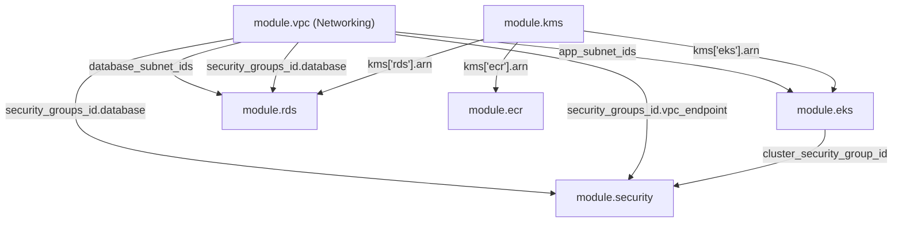

# Florence Infrastructure - Complete Technical Reference & Operational Manual

This manual provides an exhaustive architectural reference and operational manual for the **Florence Infrastructure** Terraform repository. It documents the overall project architecture, directory layout, module composition, input/output interfaces, inter-module data flow, security architecture, and end-to-end deployment workflow.

---

## Table of Contents
1. [Full Repository Directory Tree](#1-full-repository-directory-tree)
2. [High-Level Architecture & Traffic Flow](#2-high-level-architecture--traffic-flow)
3. [Inter-Module Dependency & Data Flow Graph](#3-inter-module-dependency--data-flow-graph)
4. [Bootstrap Layer (`bootstrap/`)](#4-bootstrap-layer-bootstrap)
5. [Environment Composition (`environemnts/dev/`)](#5-environment-composition-environemntsdev)
6. [Infrastructure Modules Deep-Dive](#6-infrastructure-modules-deep-dive)
   - [6.1. Networking Module (`modules/networking/`)](#61-networking-module-modulesnetworking)
   - [6.2. Security Module (`modules/security/`)](#62-security-module-modulessecurity)
   - [6.3. KMS Key Management (`modules/kms/`)](#63-kms-key-management-moduleskms)
   - [6.4. Elastic Container Registry (`modules/ecr/`)](#64-elastic-container-registry-modulesecr)
   - [6.5. Database Infrastructure (`modules/database/`)](#65-database-infrastructure-modulesdatabase)
   - [6.6. EKS Kubernetes Cluster (`modules/eks/`)](#66-eks-kubernetes-cluster-moduleseks)
7. [Security, Identity & Compliance Matrix](#7-security-identity--compliance-matrix)
8. [End-to-End Operational & Deployment Workflow Runbook](#8-end-to-end-operational--deployment-workflow-runbook)

---

## 1. Full Repository Directory Tree

Below is the complete filesystem layout of the `florence-infra` codebase:

```
florence-infra/
├── README.md                           # Comprehensive Technical Reference & Operations Manual
├── bootstrap/                          # S3 Bucket & KMS Key for Remote Terraform State
│   ├── data.tf                         # Caller identity & partition data sources
│   ├── kms.tf                          # KMS key & alias for S3 state bucket encryption
│   ├── locals .tf                      # Local prefix and tagging rules
│   ├── outputs.tf                      # Outputs for S3 bucket name, ARN, and KMS key ARN
│   ├── providers.tf                    # AWS provider configuration
│   ├── s3.tf                           # S3 backend bucket, versioning, access block, SSE
│   ├── terraform.tfvars                # Default input values for bootstrap environment
│   ├── variables.tf                    # Input variable definitions (project, env, region)
│   └── versions.tf                     # Required terraform and provider versions
├── modules/                            # Reusable Infrastructure Modules
│   ├── networking/                     # VPC & Multi-Tier Networking Submodule
│   │   ├── eip.tf                      # Elastic IP for NAT Gateway
│   │   ├── igw.tf                      # Internet Gateway for public subnet traffic
│   │   ├── locals.tf                   # Calculated subnet maps, names, and tags
│   │   ├── nacl_rules.tf               # Stateless network ACL ingress/egress rules
│   │   ├── nacls.tf                    # Public, App, and DB subnet Network ACLs
│   │   ├── nat.tf                      # NAT Gateway in public subnet for outbound traffic
│   │   ├── outputs.tf                  # VPC ID, subnet IDs lists, endpoint IDs, security_groups_id
│   │   ├── route_tables.tf             # Public, Application, and Database route tables
│   │   ├── rt_association.tf           # Route table to subnet mapping associations
│   │   ├── security_groups.tf          # Foundational SGs (ALB, Database, Bastion, VPC Endpoint) & ALB rules
│   │   ├── subnets.tf                  # Multi-AZ subnet resources (`aws_subnet.this`)
│   │   ├── variables.tf                # VPC CIDR, subnet map, metadata, common_tags
│   │   ├── versions.tf                 # Provider constraints
│   │   ├── vpc.tf                      # VPC resource (`aws_vpc.this`) with DNS enabled
│   │   └── vpc_endpoints.tf            # S3 Gateway Endpoint & Interface Endpoints
│   ├── security/                       # Dedicated Cross-Component Security Rules Submodule
│   │   ├── data.tf                     # Partition & caller identity data sources
│   │   ├── locals.tf                   # Name prefix, port rules, and tag maps
│   │   ├── outputs.tf                  # Module output place-holders
│   │   ├── security_groups.tf          # Placeholder file (Foundational SGs owned by Networking)
│   │   ├── sg_rules.tf                 # Cross-component ingress rules (EKS -> DB, EKS -> VPCE)
│   │   ├── variables.tf                # Project, environment, database_sg_id, vpc_endpoint_sg_id, eks_cluster_sg_id, db_port
│   │   └── versions.tf                 # Provider constraints
│   ├── kms/                            # KMS Key Management Submodule
│   │   ├── alias.tf                    # Customer Managed Key Aliases
│   │   ├── data.tf                     # IAM policy document generation for KMS key policies
│   │   ├── keys.tf                     # KMS key definitions (`aws_kms_key.this`)
│   │   ├── locals.tf                   # Key alias map composition
│   │   ├── outputs.tf                  # Map of key IDs, ARNs, and aliases
│   │   ├── variables.tf                # Key spec, rotation, and deletion window maps
│   │   └── versions.tf                 # Provider constraints
│   ├── ecr/                            # Container Registry Submodule
│   │   ├── data.tf                     # Account caller identity
│   │   ├── lifecycle_policies.tf       # Image retention and cleanup policies
│   │   ├── locals.tf                   # Common tags and name prefixes
│   │   ├── outputs.tf                  # ECR repository URLs, ARNs, and registry ID
│   │   ├── registry.tf                 # Automated registry scanning configuration
│   │   ├── repositories.tf             # Repositories (`aws_ecr_repository.this`)
│   │   ├── variables.tf                # Repositories map and KMS encryption config
│   │   └── versions.tf                 # Provider constraints
│   ├── database/                       # PostgreSQL RDS Submodule
│   │   ├── data.tf                     # Partition & IAM policy documents
│   │   ├── database.tf                 # Primary RDS Instance (`aws_db_instance.this`)
│   │   ├── locals.tf                   # Common tags and identifier strings
│   │   ├── monitoring_role.tf          # IAM Role for RDS Enhanced Monitoring
│   │   ├── outputs.tf                  # DB endpoint, port, address, DB name, ARN
│   │   ├── parameter_group.tf          # DB parameter group (`aws_db_parameter_group`)
│   │   ├── subnet_group.tf             # Multi-AZ DB subnet group (`aws_db_subnet_group`)
│   │   ├── variables.tf                # Database instance, storage, credentials configs
│   │   └── versions.tf                 # Provider constraints
│   └── eks/                            # Amazon EKS Kubernetes Cluster Submodule
│       ├── addons.tf                   # EKS cluster addons (vpc-cni, coredns, kube-proxy)
│       ├── cluster.tf                  # EKS Cluster resource (`aws_eks_cluster.this`)
│       ├── data.tf                     # Assume role IAM policies for EKS control plane/nodes
│       ├── iam.tf                      # IAM roles & policy attachments for EKS and nodes
│       ├── locals.tf                   # Role configurations & tagging locals
│       ├── node_group.tf               # EKS Managed Node Group (`aws_eks_node_group.this`)
│       ├── outputs.tf                  # Cluster endpoint, ARN, CA data, node role ARN
│       ├── variables.tf                # Cluster config, node config, addons config
│       └── versions.tf                 # Provider constraints
└── environemnts/
    └── dev/                            # Root Composition Environment for Development
        ├── backend.tf                  # S3 remote state configuration
        ├── data.tf                     # Availability zones data source
        ├── locals.tf                   # Subnet maps, DB config, EKS cluster/node/addon configs
        ├── main.tf                     # Module instantiations (vpc, security, ecr, kms, rds, eks)
        ├── outputs.tf                  # Module output exposures
        ├── providers.tf                # AWS provider instance settings
        ├── terraform.tfvars            # Input values for development environment
        ├── variables.tf                # Environment-level input parameters
        └── versions.tf                 # Required Terraform version constraints
```

---

## 2. High-Level Architecture & Traffic Flow

```
+---------------------------------------------------------------------------------------------------+
|                                       AWS Cloud Region (ap-south-1)                               |
|                                                                                                   |
|  +---------------------------------------------------------------------------------------------+  |
|  |                                  VPC (10.0.0.0/16)                                         |  |
|  |                                                                                             |  |
|  |   +------------------------------------+       +------------------------------------+       |  |
|  |   |        Availability Zone A         |       |        Availability Zone B         |       |  |
|  |   |                                    |       |                                    |       |  |
|  |   |  [Public Subnet 10.0.1.0/24]       |       |  [Public Subnet 10.0.2.0/24]       |       |  |
|  |   |  - Internet Gateway (IGW)          |       |  - EIP + NAT Gateway               |       |  |
|  |   |  - ALB Security Group              |       |                                    |       |  |
|  |   +------------------------------------+       +------------------------------------+       |  |
|  |                     |                                            |                          |  |
|  |                     v                                            v                          |  |
|  |   +------------------------------------+       +------------------------------------+       |  |
|  |   |     Application Subnet 10.0.11.0/24|       |     Application Subnet 10.0.12.0/24|       |  |
|  |   |  - EKS Control Plane Endpoints     |       |  - EKS Managed Node Group          |       |  |
|  |   |  - Worker Nodes (t3.medium)        |       |  - Addons (CNI, CoreDNS, Proxy)    |       |  |
|  |   |  - Interface VPC Endpoints         |       |  - S3 Gateway Endpoint             |       |  |
|  |   +------------------------------------+       +------------------------------------+       |  |
|  |                     |                                            |                          |  |
|  |                     v                                            v                          |  |
|  |   +------------------------------------+       +------------------------------------+       |  |
|  |   |      Database Subnet 10.0.21.0/24  |       |      Database Subnet 10.0.22.0/24  |       |  |
|  |   |  - PostgreSQL RDS (Multi-AZ)       |       |  - Primary / Secondary Instance    |       |  |
|  |   +------------------------------------+       +------------------------------------+       |  |
|  |                                                                                             |  |
|  +---------------------------------------------------------------------------------------------+  |
|                                                                                                   |
|   +--------------------------+  +--------------------------+  +--------------------------------+  |
|   | AWS ECR Repositories     |  | AWS KMS Keys             |  | S3 Backend Bucket              |  |
|   | - App Container Images   |  | - Database, EKS, ECR     |  | - Encrypted Terraform State    |  |
|   +--------------------------+  +--------------------------+  +--------------------------------+  |
+---------------------------------------------------------------------------------------------------+
```

---

## 3. Inter-Module Dependency & Data Flow Graph

The root environment (`environemnts/dev/main.tf`) coordinates module execution using clean data passing without circular dependencies:



### Data Flow Details:
1. **`module.vpc` (Networking)** initializes core network infrastructure (`aws_vpc.this`), subnets, route tables, and foundational Security Groups (`alb`, `database`, `bastion`, `vpc_endpoint`). It outputs `vpc_id`, subnet lists, and `security_groups_id`. `module.vpc` has **zero** dependencies on EKS or Security.
2. **`module.kms`** creates Customer Managed Keys for ECR, RDS, and EKS, exporting ARNs via `module.kms.kms`.
3. **`module.eks`** consumes `app_subnet_ids` from `module.vpc` and `kms_key_arn` from `module.kms` to deploy the cluster and node groups. It exports `cluster_security_group_id` representing the AWS-managed workload security boundary.
4. **`module.security`** acts as a cross-component security layer. It consumes `security_groups_id.database` and `security_groups_id.vpc_endpoint` from `module.vpc` AND `cluster_security_group_id` from `module.eks` to construct security rules (`EKS -> RDS PostgreSQL :5432`, `EKS -> VPC Endpoint HTTPS :443`) without creating reverse module dependencies back to `module.vpc` or `module.eks`.
5. **`module.rds`** consumes `vpc_id` and `database_subnet_ids` from `module.vpc`, `database` security group ID from `module.vpc`, and `kms_key_id` from `module.kms`.

---

## 4. Bootstrap Layer (`bootstrap/`)

The `bootstrap` directory provisions the remote state bucket and KMS master encryption key before any environment is created.

### Resources & Functions:
1. **`aws_s3_bucket.backend_bucket`** (`s3.tf`): Creates `florence-dev-${account_id}-${region}` to store Terraform state files.
2. **`aws_s3_bucket_versioning.backend_versioning`** (`s3.tf`): Enables object versioning (`status = "Enabled"`) to preserve state history.
3. **`aws_s3_bucket_public_access_block.backend_access`** (`s3.tf`): Blocks all public ACLs and bucket policies (`block_public_acls = true`, `ignore_public_acls = true`, `block_public_policy = true`, `restrict_public_buckets = true`).
4. **`aws_s3_bucket_server_side_encryption_configuration.backend_encryption`** (`s3.tf`): Enforces default server-side encryption using Customer Managed KMS Key (`aws:kms`).
5. **`aws_kms_key.backend_encryption_key`** (`kms.tf`): KMS key dedicated to state file encryption with annual rotation (`enable_key_rotation = true`).
6. **`aws_kms_alias.s3_kms_alias`** (`kms.tf`): Alias `alias/${name_prefix}-s3-kms-alias`.

---

## 5. Environment Composition (`environemnts/dev/`)

The `environemnts/dev` environment composes the active development stack:

* **`backend.tf`**: Configures S3 state storage:
  ```hcl
  terraform {
    backend "s3" {
      bucket       = "florence-dev-020139096715-ap-south-1"
      key          = "dev/terraform.tfstate"
      region       = "ap-south-1"
      use_lockfile = true
    }
  }
  ```
* **`main.tf`**: Instantiates six modules: `module.vpc`, `module.security`, `module.ecr`, `module.kms`, `module.rds`, and `module.eks`.
* **`locals.tf`**: Orchestrates configuration maps, subnet selections, KMS key references, RDS parameters, and EKS node group parameters.

---

## 6. Infrastructure Modules Deep-Dive

### 6.1. Networking Module (`modules/networking/`)

Provisions a 3-tier network architecture across Availability Zones.

* **VPC (`vpc.tf`)**: `aws_vpc.this` provisions `10.0.0.0/16` with `enable_dns_hostnames = true` and `enable_dns_support = true`.
* **Subnets (`subnets.tf`)**: Dynamically creates subnets across AZs:
  * **Public Subnets** (`10.0.1.0/24`, `10.0.2.0/24`): `map_public_ip_on_launch = true`.
  * **Application Subnets** (`10.0.11.0/24`, `10.0.12.0/24`): Private subnets for EKS worker nodes.
  * **Database Subnets** (`10.0.21.0/24`, `10.0.22.0/24`): Private subnets for PostgreSQL RDS.
* **Gateways & Routing (`igw.tf`, `nat.tf`, `eip.tf`, `route_tables.tf`, `rt_association.tf`)**:
  * Internet Gateway attached for public traffic.
  * NAT Gateway + EIP deployed in public subnets for outbound egress from private subnets.
  * Distinct route tables for Public, Application, and Database tiers.
* **Foundational Security Groups (`security_groups.tf`)**:
  * `aws_security_group.alb`: Security Group for Application Load Balancers.
  * `aws_security_group.database`: Security Group for PostgreSQL RDS.
  * `aws_security_group.bastion`: Security Group for bastion management.
  * `aws_security_group.vpc_endpoint`: Security Group for Interface VPC Endpoints.
  * Foundational ALB rules: `alb_http` (port 80) and `alb_https` (port 443) from `0.0.0.0/0`.
* **Network ACLs (`nacls.tf`, `nacl_rules.tf`)**: Stateless subnet level boundary protections for Public, App, and DB subnets.
* **VPC Endpoints (`vpc_endpoints.tf`)**:
  * Gateway Endpoint for S3 attached to private route tables.
  * Interface Endpoints for SSM, ECR, CloudWatch Logs, KMS, Secrets Manager using `aws_security_group.vpc_endpoint.id`.

---

### 6.2. Security Module (`modules/security/`)

Dedicated cross-component security relationship module for inter-module security group rules.

* **Security Group Rules (`sg_rules.tf`)**:
  * `database_postgres_from_eks`: Database ingress on PostgreSQL port `var.db_port` (5432) from `var.eks_cluster_sg_id`.
  * `vpc_endpoint_https_from_eks`: Interface VPC Endpoint HTTPS ingress on port 443 from `var.eks_cluster_sg_id`.
* **Variables (`variables.tf`)**: Accepts `database_sg_id`, `vpc_endpoint_sg_id`, `eks_cluster_sg_id`, `db_port`.

---

### 6.3. KMS Key Management (`modules/kms/`)

Customer Managed Keys (CMEK) enforcing envelope encryption across AWS services.

* **KMS Keys (`keys.tf`)**: `aws_kms_key.this` creates keys for `ecr`, `rds`, and `eks` with automatic rotation.
* **Aliases (`alias.tf`)**: `aws_kms_alias.this` creates aliases formatted as `alias/${project}-${env}-${key_name}`.

---

### 6.4. Elastic Container Registry (`modules/ecr/`)

Container image registry with automated lifecycle management and scanning.

* **Repositories (`repositories.tf`)**: Repositories created with KMS encryption and tag immutability.
* **Lifecycle Policies (`lifecycle_policies.tf`)**: Automatically purges untagged images.
* **Registry Scanning (`registry.tf`)**: Continuous vulnerability scanning on image push.

---

### 6.5. Database Infrastructure (`modules/database/`)

Managed PostgreSQL RDS instance.

* **RDS Instance (`database.tf`)**: `aws_db_instance.this`:
  * Engine: PostgreSQL 18.3 (`db.t4g.micro`).
  * Storage: 20 GB GP3 baseline, auto-scaling up to 100 GB.
  * High Availability: Multi-AZ deployment across database subnets.
  * Encryption: Volume encrypted via KMS key; credentials managed via AWS Secrets Manager.
  * Monitoring: Enhanced Monitoring (60s interval) and Performance Insights enabled.
* **Subnet & Parameter Groups (`subnet_group.tf`, `parameter_group.tf`)**: Multi-AZ subnet group and custom PostgreSQL parameters.

---

### 6.6. EKS Kubernetes Cluster (`modules/eks/`)

Production-ready Kubernetes cluster infrastructure.

* **Control Plane (`cluster.tf`)**: `aws_eks_cluster.this`:
  * Kubernetes Version: 1.35.
  * Encryption: KMS envelope encryption for Kubernetes Secrets.
  * Logging: API, Audit, Authenticator, ControllerManager, Scheduler logs enabled.
* **Managed Node Group (`node_group.tf`)**: `aws_eks_node_group.this`:
  * Compute: `t3.medium` On-Demand worker nodes.
  * Scaling: Desired = 2, Min = 2, Max = 4 nodes.
* **Addons (`addons.tf`)**: Managed `vpc-cni`, `coredns`, and `kube-proxy` addons.
* **IAM Roles (`iam.tf`)**: Control plane role (`AmazonEKSClusterPolicy`) and node group role (`AmazonEKSWorkerNodePolicy`, `AmazonEKS_CNI_Policy`, `AmazonEC2ContainerRegistryReadOnly`).

---

## 7. Security, Identity & Compliance Matrix

| Control Dimension | Implementation Mechanism | Associated Resources |
| :--- | :--- | :--- |
| **Data at Rest Encryption** | Customer Managed KMS Keys (CMEK) | `aws_kms_key.this`, `aws_db_instance.kms_key_id`, `aws_eks_cluster.encryption_config` |
| **Network Boundary** | 3-Tier Network Isolation (Public, App, DB) | `aws_subnet.this`, `aws_route_table`, `aws_nat_gateway` |
| **Ingress Rules** | Strict Port & Security Group Chaining | `aws_vpc_security_group_ingress_rule.database_postgres_from_eks` (restricts port 5432 to EKS Cluster SG) |
| **Secrets Management** | AWS Secrets Manager Managed Passwords | `aws_db_instance.manage_master_user_password = true` |
| **IAM Least Privilege** | Service-specific AssumeRole Policies | `aws_iam_role.this` for EKS Cluster & EKS Worker Nodes |
| **Vulnerability Defense** | Container Image Scanning & Tag Immutability | `aws_ecr_repository.image_tag_mutability`, `aws_ecr_registry_scanning_configuration` |

---

## 8. End-to-End Operational & Deployment Workflow Runbook

### Phase 1: Prerequisites Verification
Ensure local operational toolchains are installed:
- **AWS CLI**: `v2.x+` (`aws --version`)
- **Terraform CLI**: `v1.5+` (`terraform --version`)
- **kubectl**: Installed matching cluster version (`kubectl version --client`)

Configure AWS credentials:
```bash
aws configure
# Verify active identity
aws sts get-caller-identity
```

---

### Phase 2: Bootstrap Remote State Infrastructure
Deploy the S3 backend bucket and KMS state encryption key:

```bash
# Navigate to bootstrap directory
cd bootstrap

# Initialize Terraform plugins
terraform init

# Validate configuration
terraform validate

# Provision remote state infrastructure
terraform apply -auto-approve
```

---

### Phase 3: Provision Development Environment Infrastructure
Deploy the main environment stack (`environemnts/dev`):

```bash
# Navigate to dev environment
cd ../environemnts/dev

# Initialize backend and modules
terraform init

# Validate syntax and references
terraform validate

# Perform dry-run plan
terraform plan -out=tfplan

# Apply infrastructure execution plan
terraform apply tfplan
```

---

### Phase 4: Post-Deployment Verification & Kubernetes Setup

1. **Configure `kubectl` Context**:
   ```bash
   aws eks update-kubeconfig --region ap-south-1 --name florence-dev-cluster
   ```

2. **Verify Cluster Health**:
   ```bash
   kubectl get nodes -o wide
   kubectl get pods -A
   ```

3. **Verify Database Accessibility & KMS Encryption**:
   ```bash
   aws rds describe-db-instances --db-instance-identifier florence-dev-postgres --query "DBInstances[0].[DBInstanceStatus, StorageEncrypted, MultiAZ]"
   ```

---

### Phase 5: Infrastructure Modification & Maintenance Workflow

When updating modules or configuration:
1. Make code modifications in `modules/<module_name>/`.
2. Run `terraform fmt -recursive` to maintain standard code style.
3. Validate changes locally:
   ```bash
   cd environemnts/dev
   terraform validate
   ```
4. Generate and inspect execution plans before applying:
   ```bash
   terraform plan
   ```

---

### Phase 6: Teardown & Destruction Workflow
To safely decommission the environment:

```bash
cd environemnts/dev

# Destroy managed infrastructure
terraform destroy -auto-approve

# (Optional) Destroy bootstrap state infrastructure if decommissioning repository
cd ../bootstrap
terraform destroy -auto-approve
```

---
*Manual compiled for Florence Infrastructure Operations.*
